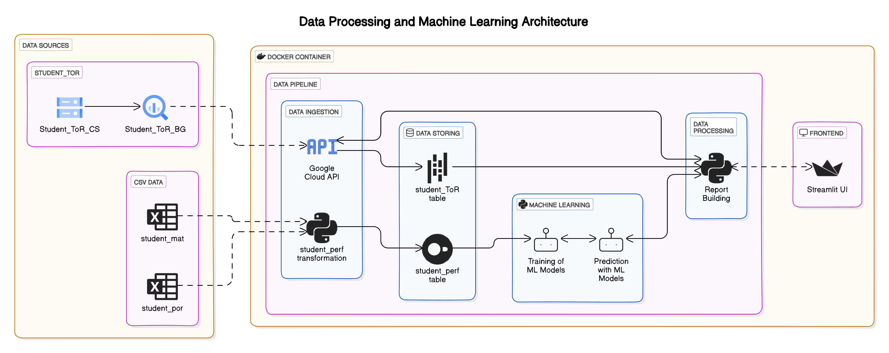
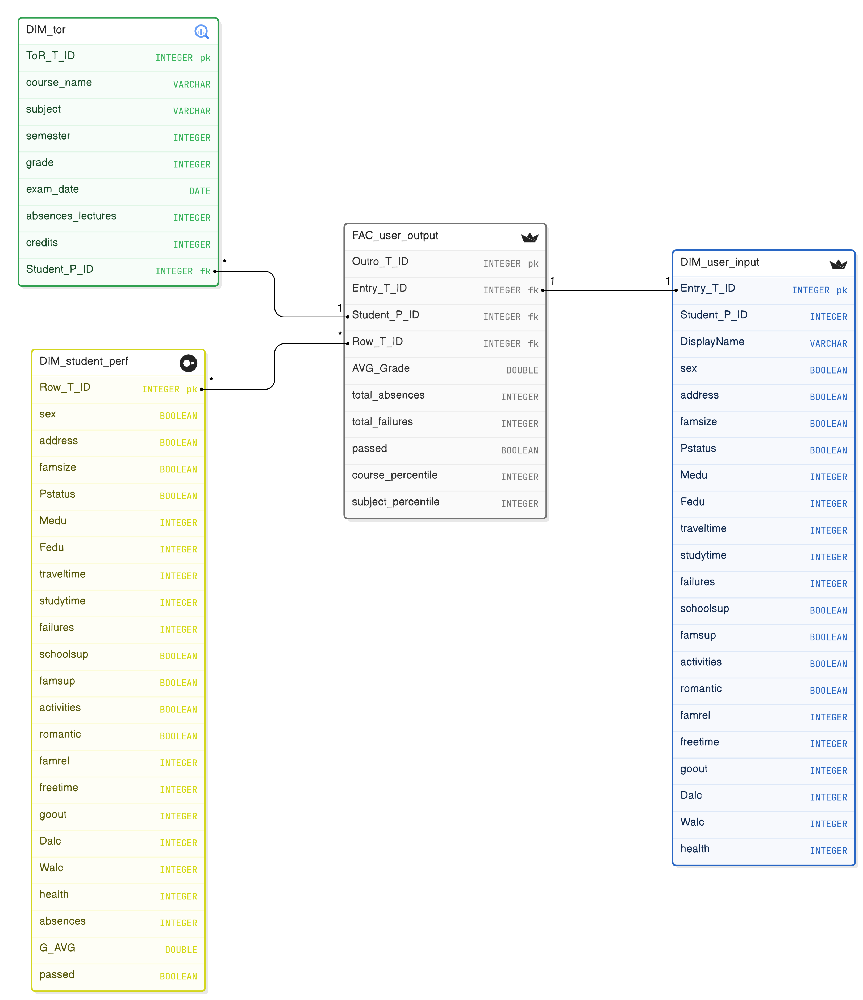

# EduInsight

This project presents EduInsight, a personalized education platform. It predicts the possible success of students based on a questionnaire about their social and familial circumstances. The application analyzes different data from multiple sources and platforms, supporting both machine learning and report building. It also generates a concise report on the student's historical performance, comparing their own performance to their study colleagues. 

## System Design

### Architecture
#### Pipeline architecture of EduInsight

#### Data Model of EduInsight


### Technologies

- Docker
- Google Cloud (Storage and BigQuery)
- DuckDB
- Pandas and Dask Dataframes
- Streamlit
- Scikit-Learn 

### Functionalities

* [x] implementation of classification machine learning model
* [x] simulation of student records 
* [x] connecting Google Cloud API to handle requests
* [x] setting up DuckDB
* [x] connecting streamlit for user input and output
* [ ] implementing document database like MongoDB for possible future exams
* [ ] moving the Scikit-Learn ML-Algorithms to Apache Spark 
## Usage

### Prerequisites

- [Docker](https://docs.docker.com/get-docker/) installed on your machine.

### Getting Started

#### Clone the Repository

First, clone the repository to your local machine: 
https://github.com/Schmiddl99/BDT24-Team8 

#### Build the Docker Image

1. Navigate to your directory where the cloned repository is located.
2. Build the Docker image using the `Dockerfile` provided in the repository:

```sh
cd /your/directory/BDT-24-Team8

docker build -t edu_insight .
```

#### Run the Docker Container

3. Run the Docker container to start the Streamlit application:

```sh
docker run -p 8501:8501 edu_insight
```

### Access the Application

4. Open your web browser and navigate to http://localhost:8501 to access the Streamlit app.

#### Example Users

We provide some Student IDs of example users: 
- 2254
- 1104

You can try it with different numbers (1000 - 9999) but that could result in an error if the Student_ID doesn't have any records.

### Stopping the application

5. Go back to the Terminal/Console where docker is running the application and press `CTRL + C`. Or go into the docker desktop application and hit the stop button on the image where it states `edu_insight`.


## Miscellaneous

### Project Dependencies

All project dependencies are listed in the `requirements.txt` file. When you build the Docker image, these dependencies will be installed automatically.

### File Structure

- `Dockerfile`: Contains the instructions to build the Docker image.
- `requirements.txt`: Lists the Python dependencies required by the application.
- `src/main.py`: The main script that runs the Streamlit application.

### Troubleshooting

If you encounter issues with missing files or directories, ensure that all necessary files are included in the repository and correctly referenced in the code.

If you open the suggested address of `http://0.0.0.0:8501` it might not work because you have to open it on `http://localhost:8501`. 

Also make sure that the port is free to access if you find yourself connected to an institution network.  

### License

This project is licensed under the MIT License - see the [LICENSE](LICENSE) file for details.

### Contributing

Feel free to submit issues or pull requests if you have suggestions or improvements.
